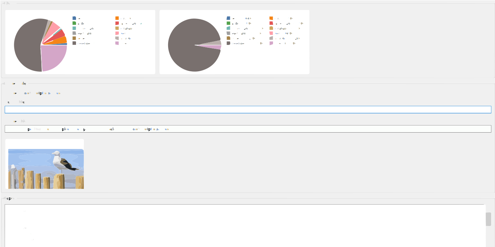

# SmartFile

SmartFile is a desktop-friendly file analysis tool built in Python that helps you scan folders, detect duplicates, understand storage usage, and organize files by category. It is designed to be simple to run while still offering a polished interface for everyday file management.

## Why SmartFile?

Managing large folders can quickly become messy. SmartFile gives you a clear overview of what is stored where, highlights duplicate files, and helps you sort content into meaningful categories with less effort.

## Features

- Folder scanning with progress feedback
- Duplicate-file detection using content hashing
- Category-based file organization and sorting
- Disk usage statistics with human-readable sizes
- Interactive charts for file counts and storage breakdowns
- Media and image preview support
- Searchable preview list for quicker browsing
- Favorite folders for fast access
- Exportable analysis reports
- Duplicate deletion workflow for cleanup

## Screenshots

### Main Dashboard


### Preview and Report Panel



## Installation

1. Clone the repository:
   ```bash
   git clone https://github.com/your-username/smartfile.git
   cd smartfile
   ```

2. Install the required Python dependencies:
   ```bash
   pip install pillow
   ```

3. Run the application:
   ```bash
   python interface.py
   ```

## Usage

- Launch the app with the command above.
- Choose a folder to scan.
- Review the generated report, charts, and preview list.
- Use the organize and duplicate cleanup tools when needed.

## Project Structure

- interface.py — Tkinter desktop interface
- scanner.py — Multithreaded folder scanning
- duplicatefinder.py — Duplicate detection logic
- sorter.py — File categorization and organization
- statfinder.py — Folder statistics and size formatting
- smartfile.py — Command-line entry point

## License

This project is open source and available under the MIT License.
